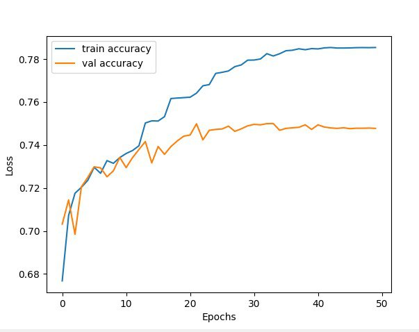
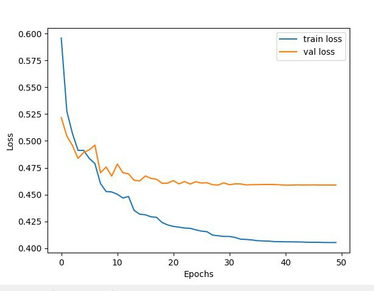
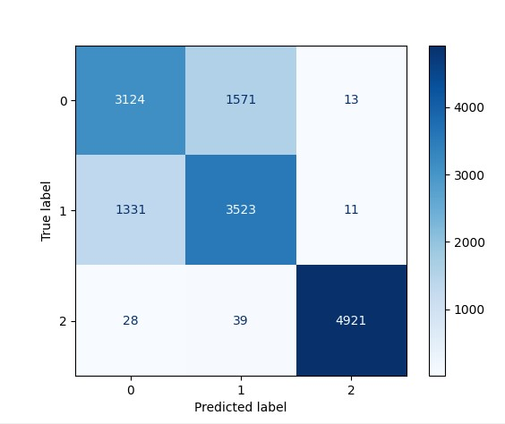
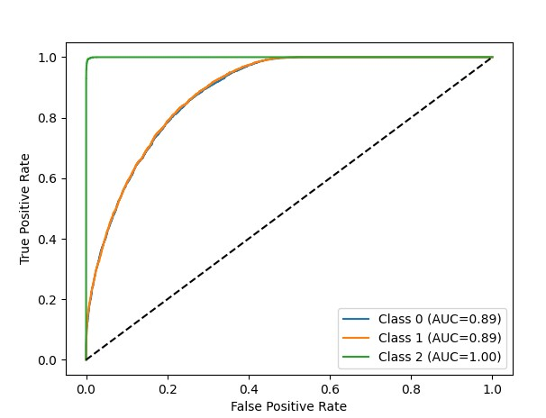
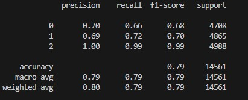
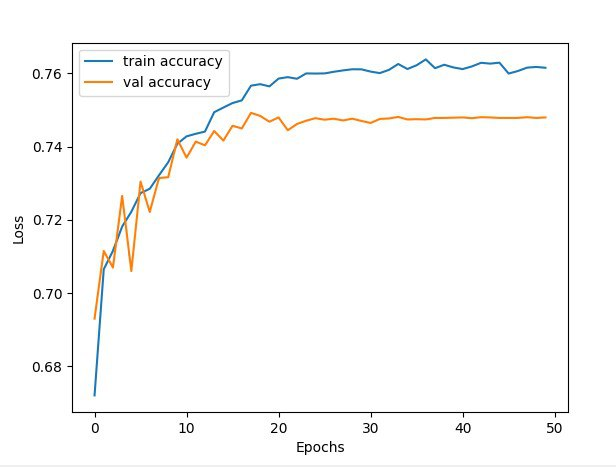
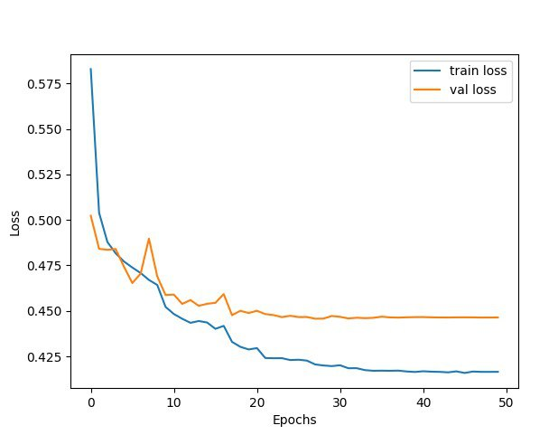
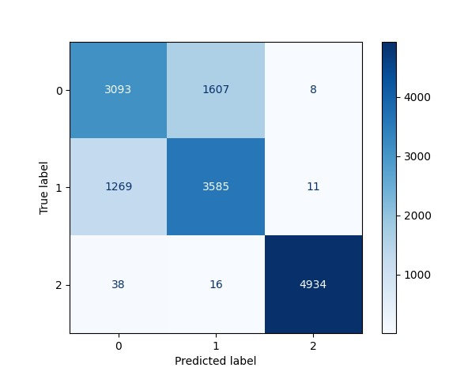
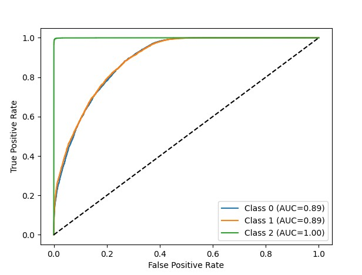
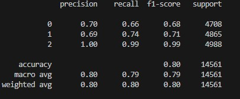

# Crypto Predictor
## Predicting Up, Down, or Flat movements based on  OHLCV candles 

###  Description
This project uses two neural networks to predict Bitcoin's direction of movement (up, down, flat) based on technical indicators calculated using OHLCV data from Bybit (spot trading, 30-minute candles).
**Technologies:**
Python, TensorFlow/Keras, NumPy, Pandas, Matplotlib, Scikit-learn,Technical Analysis (ta), requests, keras_tuner

### Data
**Source:** Bybit, spot trading

**Format:** OHLCV (Open, High, Low, Close, Volume) candles, 30-minute
Raw data is fetched and processed using `get_raw_candles_csv` in `data\raw_data\get_raw_candle.py` from Bybit API.

**Technical indicators:** 
The dataset is prepared using `processing_data_c5` in file:`data\ready_data\processing_raw_candle.py`, which calculates technical indicators and creates a training CSV file.

| Indicator                                                            | Description                                                         |
| -------------------------------------------------------------------- | ------------------------------------------------------------------- |
| **Close_t, Close_(t-1), Close_(t-2), Close_(t-3), Close_(t-4)**      | Percentage change of closing price over the last 1–5 candles        |
| **Volume_t, Volume_(t-1), Volume_(t-2), Volume_(t-3), Volume_(t-4)** | Percentage change of volume over the last 1–5 candles               |
| **Body_size**                                                        | Candle body size (Close − Open)                                     |
| **Range**                                                            | Candle range (High − Low)                                           |
| **Body/Range_ratio**                                                 | Ratio of candle body to its range                                   |
| **Upper_shadow**                                                     | Upper shadow of the candle (High − max(Open, Close))                |
| **Lower_shadow**                                                     | Lower shadow of the candle (min(Open, Close) − Low)                 |
| **RSI_14**                                                           | Relative Strength Index (14 periods)                                |
| **MACD, MACD_signal, MACD_diff**                                     | MACD moving averages (12,26,9) and difference with signal line      |
| **ATR_14**                                                           | Average True Range over 14 candles                                  |
| **BB_bbm, BB_bbh, BB_bbl, BB_bbw, BB_percent**                       | Bollinger Bands (middle, upper, lower, width, and percent position) |
| **EMA_10, EMA_50, EMA_diff, EMA_200**                                | Exponential Moving Averages (10, 50, 200) and their difference      |
| **Distance_to_High, Distance_to_Low**                                | Distance to local highs and lows over the last 48 candles (~1 day)  |
| **ATR_ratio**                                                        | Ratio of current ATR to median ATR over 30 candles                  |
| **OBV, OBV_slope**                                                   | On-Balance Volume (OBV) and its slope (change)                      |

### Data Generation

1. Fetch raw OHLCV data from Bybit API using:
   `data\raw_data\get_raw_candle.py`

2. Calculate technical indicators and prepare dataset with:
   `data\ready_data\processing_raw_candle.py`

Output dataset is saved to:
`data/ready_data/samples/dataset.csv`

_Normalized data is fed to the input of the neural network._

### Models
The models perform the same functionality, have similar performance parameters, but have different structures.

Model A: `models\MLP\best_model_1`<br>
Model B: `models\MLP\best_model_2`<br>

|   | Model A  | Model B |
|:------------- |:---------------:| -------------:|
| Number of layers | 4        |  3        |
| Number of input parameters | 34        | 34   |
| The number of neurons in the first hidden layer | 416 | 992 |
| The number of neurons in the second hidden layer | 16 | - |
| Hidden layer activation function | relu | relu |
| Number of neurons in the output layer | 3 | 3 |
| Output layer activation function | softmax | softmax |
| Optimizer     | Adam                     | Adam                     |
| Loss function | Categorical Crossentropy | Categorical Crossentropy |

### Metrics & Visualization
Model A: `models\MLP\best_model_1`<br>
Model B: `models\MLP\best_model_2`<br>

**Model A:**

**_Accuracy / Loss:_** <br>

<br>


**_Confusion matrix:_** <br>


**_Distribution:_** 
Class distribution (y_test): [4708 4865 4988] <br>
Prediction distribution: [4483 5133 4945] <br>

**_Receiver Operating Characteristic:_** <br>


**_Classification report:_** <br>


**Model B:**

**_Accuracy / Loss:_** <br>

<br>


**_Confusion matrix:_** <br>


**_Distribution:_** <br>
Class distribution (y_test): [4708 4865 4988] <br>
Prediction distribution: [4400 5208 4953] <br>

**_Receiver Operating Characteristic:_** <br>


**_Classification report:_** <br>


### Usage

**Options for interacting with the model:**

1.Use console application:
```bash
git clone https://github.com/TalonProbeite/CryptoPriceML.git
cd CryptoPriceML
pip install -r requirements.txt
python src\usage\run.py
```
